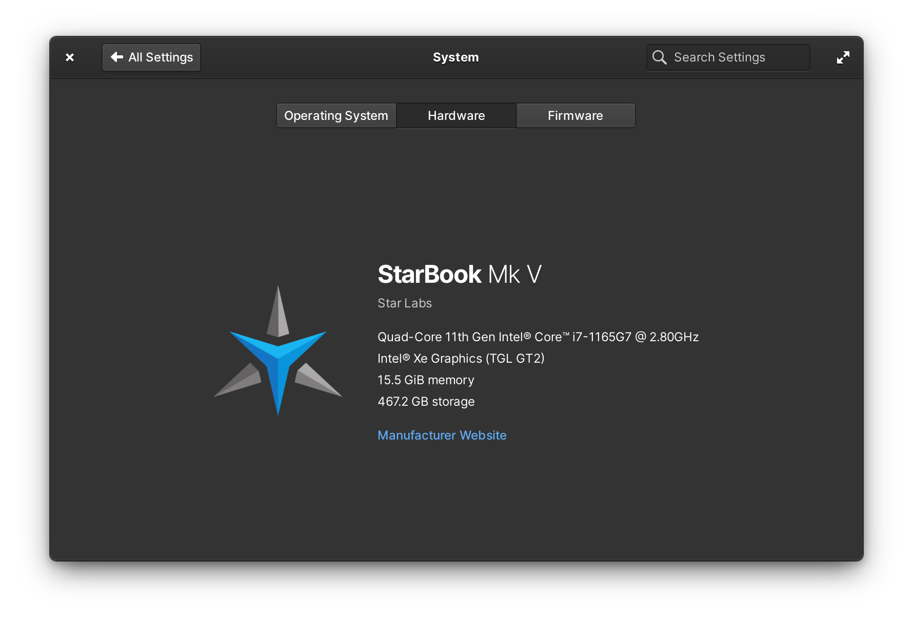

# oem-info

OEM Info for elementary OS System Settings

 | 
------------------------------|----------------------------------------

## To use:

1. Find your device in the list of folders
2. Copy the device's folder's contents to `/etc/` (on elementary OS, open Files as Administrator or use `sudo` from Terminal)
3. Open _System Settings_ → _System_ → _Hardware_ on elementary OS 6 to see the prettiness

## Contributing

I made this for the various devices I use/have used that didn't provide good data out of the box, but pull requests are welcome for more hardware!

See the [Switchboard About Plug's OEM Configuration section](https://github.com/elementary/switchboard-plug-about/#oem-configuration) for more info.

### Images

Images should:

- Ideally represent the hardware itself, but an OEM logo is an acceptible fallback
- Have a square aspect ratio
- Have a transparent background
- Be at least 256×256 to ensure they show well on HiDPI displays
- Be 512×512 at the largest for filesize concerns
- Work on both light and dark backgrounds

#### To make an image:

Start with the highest-resolution representitive image you can with a transparent background. Alternatively, grab the OEM logo with a transparent background.

1. Open in GIMP
2. Crop the image to the content
3. If the image is larger than 512 in either dimension, scale it down to 512 on the longest side
4. If the canvas is not square, resize the canvas to a square and center the image
5. Export as a PNG
